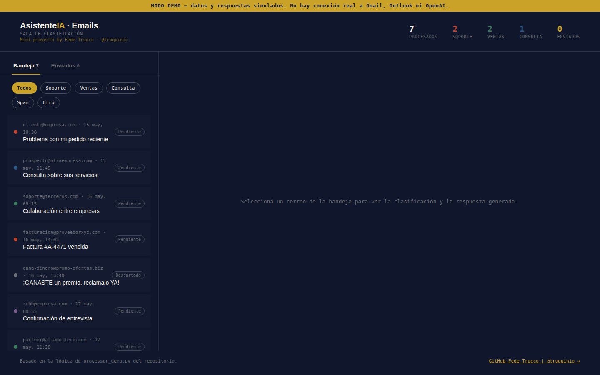
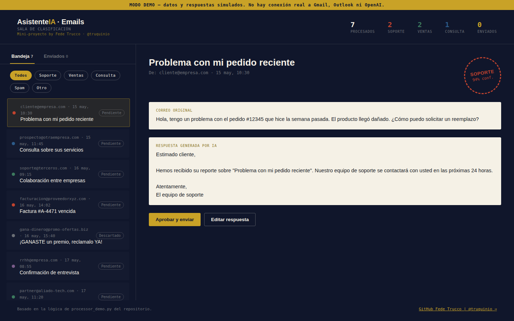
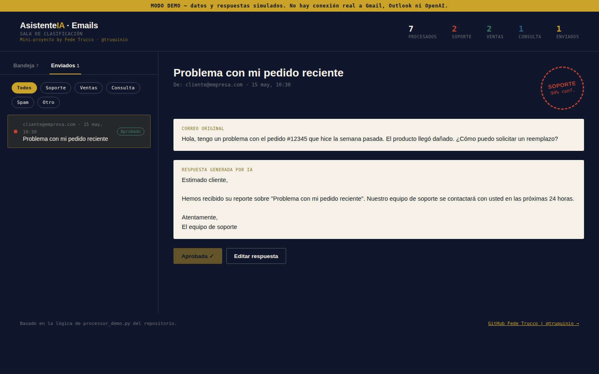

# 📧 Asistente Automatizado de Emails con IA

### Clasificación y redacción asistida de correo electrónico

---

## 👀 De un vistazo

El repositorio contiene dos piezas separadas:

- 🖥️ una **demo interactiva** en HTML/CSS/JavaScript publicada en GitHub Pages;
- 🐍 un **prototipo backend** en Python para recuperar correo por IMAP, clasificarlo y generar una respuesta propuesta mediante OpenAI API.

La demo funciona con datos simulados y no necesita acceso a ninguna cuenta real.

## 📸 Capturas

| Bandeja | Clasificación + respuesta | Enviados |
| --- | --- | --- |
|  |  |  |

## 🧠 Flujo previsto

~~~mermaid
sequenceDiagram
    participant Mail as Cuenta de correo
    participant App as EmailProcessor
    participant AI as OpenAI API
    App->>Mail: Recupera mensajes no leídos por IMAP
    Mail-->>App: Mensajes
    App->>AI: Solicita clasificación
    AI-->>App: Categoría
    App->>AI: Solicita respuesta propuesta
    AI-->>App: Texto generado
~~~

## ✨ Capacidades presentes en el código

- categorías: soporte, ventas, consulta, spam y otros;
- conexión IMAP mediante SSL;
- recuperación de mensajes no leídos;
- clasificación mediante Chat Completions;
- generación de respuesta según categoría;
- fallback cuando la generación falla;
- límite de procesamiento configurable;
- frontend demo independiente del correo real.

## ⚠️ Estado del backend

> [!WARNING]
> **Prototipo / work in progress.** El backend actual tiene un desajuste entre src/real/processor.py y config.py: el procesador importa Config, mientras el módulo de configuración expone Settings y una instancia config.

Por ello no se presenta como flujo productivo validado end-to-end. La demo de GitHub Pages es independiente de ese problema.

## ▶️ Preparar el entorno

<strong>Ver instalación</strong>

~~~bash
git clone https://github.com/truquinio/Asistente-automatizado-de-Emails-con-IA.git
cd Asistente-automatizado-de-Emails-con-IA
python -m venv venv
~~~

Linux/macOS:

~~~bash
source venv/bin/activate
pip install -r requirements.txt
cp .env.example .env
~~~

Windows PowerShell:

~~~powershell
.\venv\Scripts\Activate.ps1
pip install -r requirements.txt
Copy-Item .env.example .env
~~~

Nunca subas credenciales reales al repositorio.

## 🗂️ Estructura

<strong>Ver estructura del repositorio</strong>

~~~text
.
├── index.html
├── style.css
├── script.js
├── screenshots/
├── .env.example
├── requirements.txt
├── config.py
└── src/
    ├── demo/
    ├── real/
    │   └── processor.py
    └── utils/
        ├── email_parser.py
        └── response_generator.py
~~~

## 🔐 Seguridad

- .env.example es sólo una plantilla;
- el acceso IMAP necesita credenciales propias;
- las respuestas de IA deben revisarse antes de cualquier uso real.

## 📜 Licencia

[MIT](LICENSE)

---

**Federico Trucco / [@truquinio](https://github.com/truquinio)**
